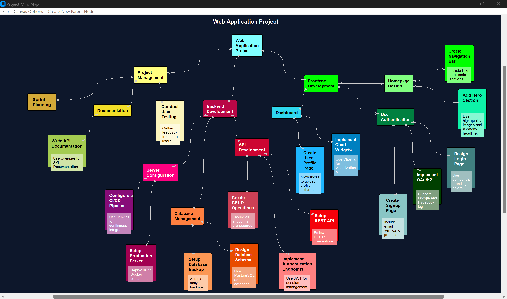

# Project MindMap

Project MindMap is an interactive mind mapping application built using Python. This app allows users to create, customize, and save mind maps, providing a visual representation of ideas and concepts. The source code for Project MindMap can be found in the 'project_mindmap.py' Python file, and is available as a standalone, executable application here:   [Download Project MindMap](https://github.com/aboliveira1/project-mindmap/releases/download/v1.0/project_mindmap.exe)


<div align="center">
    
</div>

## Features

- **Interactive Canvas**: Drag-and-drop nodes on a zoomable and scrollable canvas.
- **Customizable Nodes**: Change node colors, add notes, attach files, and create subnodes.
- **Context Menu**: Perform actions like deleting, renaming, editing colors, and managing attached files via a right-click context menu.
- **Save and Load**: Save mind maps to a JSON file and load them back into the application.
- **Canvas Options**: Set a canvas title and change the canvas background color.
- **Responsive UI**: Smooth scrolling and resizing of the canvas with customizable scroll regions.

## Usage Instructions

### Main Interface

1. **Creating a Root Node**: 
   - Use the `Create New Parent Node` option from the menu to add a new root node to the canvas.
   - Enter the node text in the prompt and select a color for the node.

2. **Adding Subnodes**:
   - Double-click on an existing node to add a subnode.
   - Enter the subnode text in the prompt and select a color for the subnode.

3. **Dragging Nodes**:
   - Click and hold the left mouse button on a node to drag it around the canvas.

4. **Context Menu**:
   - Right-click on a node to open the context menu with options to delete, rename, edit color, add/edit notes, attach files, and manage attached files.

5. **Managing Attached Files**:
   - Use the `Attach Files` option from the context menu to attach files to a node.
   - Use the `Open Attached Files` submenu to open any attached files.
   - Use the `Unattach Files` submenu to remove attached files from a node.

6. **Editing Notes**:
   - Use the `Add/Edit Notes` option from the context menu to add or edit notes for a node.


### Canvas Options

1. **Set Canvas Title**:
   - Use the `Set Canvas Title` option from the `Canvas Options` menu to set a title for the canvas.

2. **Change Background Color**:
   - Use the `Change Background Color` option from the `Canvas Options` menu to change the canvas background color.


### Saving and Loading

1. **Save Mind Map**:
   - Use the `Save` option from the `File` menu to save the current mind map to a JSON file.

2. **Load Mind Map**:
   - Use the `Load` option from the `File` menu to load a previously saved mind map from a JSON file.


## Necessary Libraries

To run Project MindMap, the following Python libraries need to be installed:

- **customtkinter**: A modern and customizable tkinter-based UI toolkit. (https://github.com/TomSchimansky/CustomTkinter)

You can install `customtkinter` using pip:

```bash
pip install customtkinter


